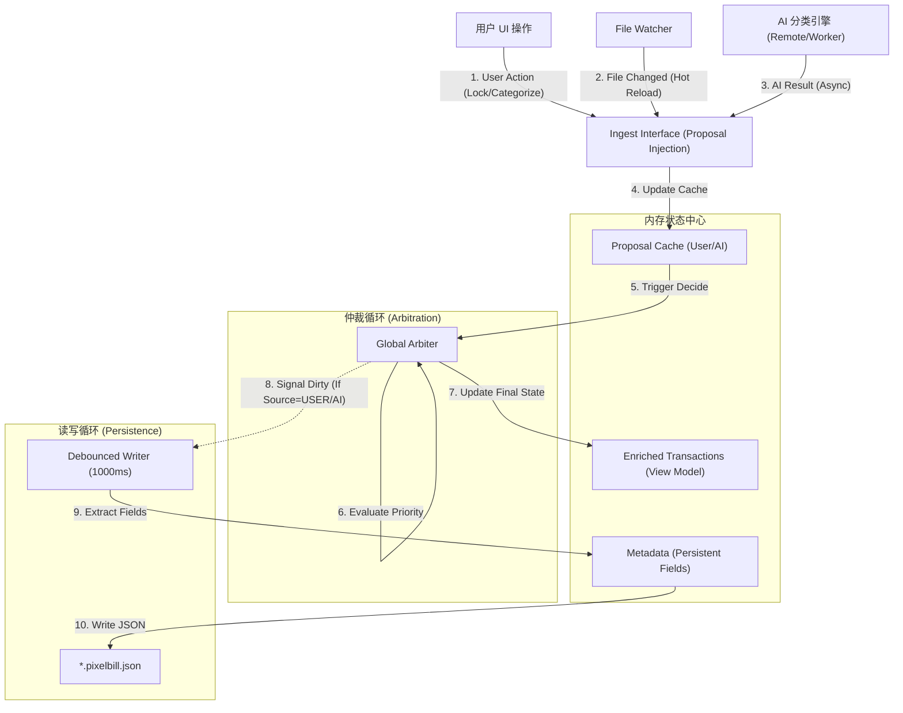

# 极简像素风账单整合器设计文档 (PixelBill)

> **状态说明（已过时）26年4月**
>
> 本文档当前仅保留为历史设计记录，**不再作为 PixelBill 当前阶段，尤其是 AI 自学习 P2 / P3 冲刺期的实施依据**。
>
> 当前功能口径、交互冻结口径与验收标准，以项目根目录下的 `CLAUDE.md` 与 `AI_SELF_LEARNING_DESIGN_v5.md` 为准；若本文档与实现或上述文档冲突，应视为本文档内容已过时。

**Designed by CyberZen Studio**

## 1. 项目概述
本项目是一个运行在本地的纯前端单页应用（SPA）个人记账应用，旨在安全、高效地整合微信和支付宝的账单流水 CSV 文件。项目采用 **"当代生成式点阵" (Contemporary Generative Dot Matrix)** 风格，去除多余装饰，强调数据的纯粹与美感。

PixelBill 奉行“生成式极简主义”与“赛博禅意”的设计哲学，采用 “当代生成式点阵” (Contemporary Generative Dot Matrix) 风格，旨在构建一个 冷静、理性、清晰、秩序感、像素美学的数字化金融终端 。

它摒弃一切多余装饰，利用 实体像素 （象征金钱/价值）与 虚空网格 （象征秩序/空间）的二元隐喻将抽象数据具象化；通过 固定深空背景 与 4秒呼吸光晕 营造出独特的 赛博禅意 (Cyber-Zen) ；让数据成为界面本身，利用 动态活跃度矩阵 与 心理账户点阵 ，将冰冷的流水重构为富有韵律的视觉秩序。

## 2. 视觉设计系统 (Visual Design System)

本章节定义了 PixelBill 的核心视觉语言，旨在构建一个精密、理性且富有生命力的数字金融终端界面。

### 2.1 核心设计哲学 (Design Philosophy)

*   **混合像素点阵 (Hybrid Pixel-Dot)**: 
    *   **Pixels (实体)**: 方形像素块象征确定的“金额”与“实体资产”。使用绿色像素块从隐喻层面与金钱挂钩。
    *   **Dots (虚空)**: 圆形点阵或网格象征“数据流”与“底层结构”。用于背景、装饰和非强调性信息。
*   **生成式极简主义 (Generative Minimalism)**: 界面元素并非静态堆砌，而是由数据驱动生成。活跃度矩阵、金额条形码等元素随数据的变化而呈现不同形态。
*   **非侵入式交互 (Non-intrusive Interaction)**: 摒弃弹窗和强引导，采用呼吸光效、微小的故障 (Glitch) 效果和透明度变化来提示状态。

### 2.2 栅格与布局 (Grid & Layout)

*   **Base Unit**: 4px。所有间距、尺寸均为 4px 的倍数。
*   **Layout Grid**: 12 列响应式栅格系统。
    *   Desktop: 最大宽度 1024px，居中显示。
    *   Mobile: 100% 宽度，两侧保留 24px padding。
*   **Fixed Background**: 背景采用固定定位 (`fixed inset-0`) 的点阵纹理，层级 `z-[-1]`，确保内容滚动时背景保持静止，营造深邃的“空间感”。
*   **Spacing**: 强调疏密有致。
    *   Tight: 4px / 8px (组件内部)
    *   Default: 16px / 24px (组件之间)
    *   Loose: 48px / 64px (区块之间)
*   **Alignment (对齐规范)**:
    *   **Dashboard Panels**: 统计数字区面板统一采用 **Top-Center** 对齐。
        *   水平方向：居中 (`text-center` / `items-center`)。
        *   垂直方向：顶部对齐 (`justify-start`)，配合 `p-2` 内边距。
        *   **禁止**: 垂直居中对齐，以避免不同高度内容导致的视觉错落，以及展开动画时的位置跳变。

### 2.3 字体排印 (Typography)

采用混合字体策略，以区分“数据阅读”与“品牌表达”。

*   **Display Font (标题/品牌)**: 
    *   **Pixel**: `Press Start 2P` - 用于 "PIXEL" 字样，传递复古计算感。
    *   **Grid Dot Matrix**: **自定义网格点阵实现** - 用于 "BILL" 字样。弃用字体渲染，改用 4x5 标准点阵网格构建字母，确保行列严格对齐。
    *   **视觉对齐**: "BILL" 点阵字样通过 `-translate-y-[2px]` 微调，确保与左侧 "PIXEL" 文字实现完美的光学对齐。
*   **Body/Data Font (正文/数据)**: 
    *   **Monospace**: `Space Mono`, `Microsoft YaHei Mono` - 用于所有金额、日期、正文。
    *   **特性**: 等宽字体确保了数据列表的纵向对齐，增强了“账单”的表格属性。

### 2.4 色彩系统 (Color System)

基于 Dark Mode 优先的设计，使用高对比度的荧光色点缀深色背景。

*   **Background (Canvas)**:
    *   `--bg-color`: `#09090b` (Zinc 950)
    *   `--card-bg`: `#111111` (卡片背景，微弱提升层级)
*   **Foreground (Content)**:
    *   `--text-primary`: `#e4e4e7` (Zinc 200)
    *   `--text-dim`: `#6b7280` (Gray 500，用于辅助信息)
*   **Semantic Colors (Functional)**:
    *   **Pixel Green**: `#10b981` (Emerald 500) - 主题绿色，用于品牌标识、Logo 呼吸灯、热力图条、AI 控制图标（分析中）。
    *   **Alipay Blue**: `#0ea5e9` (Sky 500) - 支付宝支付、链接。
    *   **Expense Red**: `#ef4444` (Red 500) - 所有支出金额显示。
    *   **Income Yellow**: `#eab308` (Yellow 500) - 所有收入金额显示。

### 2.5 动效与交互 (Motion & Interaction)

*   **Breathing & Glow (呼吸与光晕)**:
    *   **Global Heartbeat (全局心跳)**: 所有持续性呼吸动画（Logo, Text Glow, Loading Skeletons）必须统一使用 `4s` 周期 (`cubic-bezier(0.4, 0, 0.6, 1)`)。
    *   **Synchronization (同步)**: 禁止使用不同频率的呼吸动画混杂。Skeleton 屏的脉冲 (`pulse-slow`) 必须与 Header Logo 的 `box-glow` 保持同频，营造“系统待机”的整体生命感。
    *   **Implementation**: 统一使用 Tailwind 的 `animate-pulse-slow`, `animate-box-glow`, `animate-text-glow` 类。
*   **Glitch (故障)**: 在活跃度矩阵中引入极低概率的随机位移或透明度抖动。
*   **Micro-interactions**:
    *   **Data Emergence (数据浮现)**: 采用 **"In-place Morphing & Activation" (原地演变与激活)** 策略。
        *   **Core Logic**: 界面骨架（DOM 结构）坚如磐石，严禁布局抖动 (Layout Shift)。数据加载表现为“容器”被“内容”填充并激活的过程。
        *   **Stats Panel (统计面板)**: **Pulse Switch (脉冲切换)**。
            *   面板容器高度固定不变。
            *   `AWAITING_DATA` 占位符原地淡出 (Opacity 1->0)。
            *   真实数值在**同一坐标**原地淡入 (Opacity 0->1)，伴随微弱的 **Overexposure (过曝)** 效果 (Brightness 1.5 -> 1.0)，模拟能量注入瞬间。
        *   **Transaction List (交易列表)**: **Scanline Cascade (扫描线级联)**。
            *   列表容器保持静止，骨架行 (Skeleton Row) 不消失位移。
            *   采用 **Row-by-Row Replacement (逐行替换)**：从上至下，骨架条被真实数据条原地替换。
            *   **Light Flow (光流)**: 通过极快的时间差 (Stagger 0.03s) 形成从上至下的激活波浪，仿佛屏幕刷新扫描线扫过。
        *   **Filter Tabs (标签栏)**: **Ripple Expansion (涟漪扩散)**。
            *   Ghost Tabs (虚影) 原地变形为真实 Tabs。
            *   **Center-Out (中心扩散)**: 激活信号从当前选中的标签开始，向左右两侧呈涟漪状扩散点亮，模拟信号源的传播。
*   **AI 落袋遮盖原则 (AI Write-Through Masking)**:
    *   **目标**: 落袋动画必须遮盖列表刷新，避免用户先看到内容跳变。
    *   **触发时机**: 在 AI 结果应用到 UI 之前触发落袋动画，而非在处理完成后触发。
    *   **结果时序**: 先触发落袋，再应用结果，列表刷新应发生在落袋过程内部。
*   **AI 列表延迟与退出时序 (AI Delay & Exit Sequencing)**:
    *   **轻量延迟**: 允许列表刷新施加极短延迟，使落袋在首帧可见，避免“列表先变”。
    *   **软停止顺序**: 在 STOPPING 阶段必须保持“最后一次落袋闪烁 → 光环立即消失”的固定顺序。
    *   **自动完成顺序**: 当所有日期处理完毕时，必须触发最后一次落袋，再紧接光环消失。
*   **Animation Standards (动画规范)**:
    *   **No Bounce Policy (无弹性原则)**: 金融数据界面追求精准与理性，**严禁使用 Spring (弹簧) 物理效果**。所有过渡必须是确定性的 (Deterministic) 贝塞尔曲线，避免任何回弹或震荡。
    *   **Structural Layer (结构层)**: `0.6s` `[0.25, 1, 0.5, 1]` (EaseOutQuart-like)。用于 Tab 切换、页面进出、大模块位移。此曲线特点是**极速启动、优雅停车**，确保用户意图被立即响应，同时视觉落点平滑。
    *   **Component Layer (组件层)**: `0.3s` `easeInOut`。用于 DateRangePicker 展开、局部面板变形。使用对称缓动以保持组件的“呼吸感”。
    *   **Micro Layer (微交互层)**: `0.2s` (Fast Linear/EaseOut)。用于 Hover、点击反馈、分页滑动。
*   **Context-Aware Transitions (上下文感知转场)**:
    *   **Tab Switching (标签切换)**: 采用 **"Slide + Blur + Fade"** 组合动画。内容根据切换方向（左/右）进行横向位移，配合模糊和透明度变化，营造空间导航感。
    *   **Infinite Carousel (无限轮盘)**:
        *   **交互逻辑**: 标签列表支持无限循环滑动，首尾相接，无边界感。
        *   **实现原理**: 采用 `[Tail Buffer] + [Core] + [Head Buffer]` 的三段式数据结构。当滚动至 Buffer 区时，静默跳转至 Core 区对应位置。
        *   **动态绑定 (Dynamic LayoutId)**: 必须根据当前渲染的 buffer 位置动态计算 `layoutId` (如 `tab-indicator-active` 仅绑定到当前视口中的实例)，确保绿色指示器在 DOM 重排时能正确捕捉目标，避免“飞来飞去”的错误动画。
        *   **Scroll Sync (滚动同步)**: 严禁使用原生 `scrollTo` 进行动画。必须使用基于 `requestAnimationFrame` 的自定义 `animate()` 函数配合 `EaseOutQuart` 曲线，确保滚动惯性与页面其他 Framer Motion 动画（如绿色滑块）的物理特性完全一致，消除“滑块追不上内容”的视觉撕裂感。
        *   **Center Snap**: 滚动停止时，最近的标签自动吸附居中并激活。
    *   **Pagination (翻页)**: **快速滑动 (Fast Swipe)**。采用 `0.3s` `cubic-bezier(0.4, 0, 0.2, 1)` 转场，保留方向感但拒绝拖泥带水。

### 2.6 核心组件规范 (Component Specifications)

#### A. Header (控制台)
*   **Logo**: 结合像素与点阵字体，左侧绿色像素块应用 `animate-box-glow` 动画。
*   **Title**: "PIXEL" 使用像素字体，"BILL" 使用自定义点阵组件并应用 `animate-text-glow` 绿色光晕。
*   **Subtitle**: "GENERATIVE FINANCIAL TRACKER" 左侧 padding 对齐 Logo 宽度，保持视觉整洁。
*   **Controls**: 按钮摒弃传统实体背景，采用“文本+前置像素块”的形式，Hover 时改变透明度。

#### B. Activity Matrix (活跃度矩阵)
*   **Visualization**: 14 天数据可视化。
*   **Data-Ink**: 每一列代表一天，由 20 个垂直排列的微型像素块组成。
*   **Intensity**: 
    *   高度：固定 20 格。
    *   激活数量：由 `Total Expense` 决定。
    *   透明度/颜色：当日无消费则微弱显示占位符，有消费则高亮。支持 Hover 查看详情。

#### C. Transaction List (流水清单)
*   **Row Style**: 极简条目，去除斑马纹，仅保留底部分割线或 margin。
*   **Content Layout**:
    *   **Primary Line**: `[Category Tag] Product/Counterparty`
        *   **Category Tag**: 仅非 `others` 分类显示。格式 `[CATEGORY]` (如 `[MEAL]`)，颜色 `text-income-yellow`。
    *   **Secondary Line**: `Raw Class • Counterparty`
        *   使用 CSV 原始分类字符串 (Raw Class) 作为副标题，而非归一化后的分类名，保留原始数据细节。
*   **Indicator**: 
    *   **WeChat**: 3x3 绿色实心像素块。
    *   **Alipay**: 3x3 蓝色实心像素块。
*   **Amount Visualization**: **心理账户分级点阵 (Psychological Account Matrix)**。
    *   **问题解决**: 解决线性归一化导致小额交易（如 5元 vs 40元）无法区分的问题。
    *   **逻辑**: 采用符合生活经验的**非线性固定阈值**，确保不同量级的消费有稳定的视觉反馈。
    *   **分级标准**:
        *   **1 Dot**: ≤ 20 (琐碎/早餐/饮料)
        *   **2 Dots**: ≤ 100 (正餐/日用品/打车)
        *   **3 Dots**: ≤ 300 (聚餐/购物/超市)
        *   **4 Dots**: ≤ 2000 (轻奢/电子/大额)
        *   **5 Dots**: > 2000 (巨额/房租/理财)
    *   **视觉**: 保持 5 点阵列，使用 **像素方块**（非圆点）表示消费量级，**支出使用红色**，收入使用黄色。

### 2.7 架构原则 (Architectural Principles)

*   **Value Convergence (值收敛策略)**: 严格复用现有设计常量。禁止引入新的动画时间（只能选 0.6s, 0.3s 或 0.2s）、颜色或间距，除非有压倒性的理由。
*   **Mixed Animation Ban (混合动画禁令)**: 同一个组件禁止混用 CSS Transition 和 Framer Motion。如果组件参与 Layout 动画，其所有状态（Hover, Active）必须全权委托给 Framer Motion 管理，防止冲突导致的视觉跳动。
*   **Layout Projection Integrity (布局投影完整性)**:
    *   **Global Sync**: 任何跨组件的跟随动画（如 Tab Indicator 随内容滚动），必须通过 Layout Projection (`layoutId`) 实现，而非手动计算位置。
    *   **Isolation**: 为避免不必要的重排，仅在真正需要变形的叶子节点使用 `layoutId`，严禁在父容器随意添加 `layout` 属性。
*   **Core Logic Decoupling (核心逻辑解耦)**:
    *   **Service Layer**: 核心业务逻辑（如账本管理、持久化）必须封装在独立的 Service/Singleton 中，严禁耦合在 React 组件生命周期内。
    *   **View Model**: React 组件仅作为 View Model 订阅 Service 状态，不直接处理底层 I/O。


## 3. 功能特性与交互流程 (Features & Interaction)

### 3.1 核心功能 (Core Features)

*   **F1. 智能数据导入 (Smart Import)**:
    *   **批量处理**: 支持一次性选择文件夹，系统自动递归读取其中所有 `.csv` 文件。
    *   **格式自适应**: 自动识别微信支付 (UTF-8) 和支付宝 (GBK) 账单格式，无需人工干预编码。
    *   **隐私安全**: 采用纯前端解析 (Local Parsing)，所有数据均在浏览器内存中处理，绝不上传服务器。

*   **F2. 生成式活跃度矩阵 (Generative Activity Matrix)**:
    *   **时间窗口**: 动态展示最近 14 天的消费热力。
    *   **数据映射**: 像素阵列的高度与透明度直接映射当日消费总额 (Total Expense)。
    *   **动态阈值**: 系统根据当前数据范围自动计算最大值 (Max Value)，动态调整可视化比例。

*   **F3. 智能交易分类 (Smart Categorization)**:
    *   **自动标记**: 内置关键词引擎（支持扩展），自动识别“餐饮”、“外卖”等消费场景并标记为 `[MEAL]`。
    *   **多维视图**: 提供 `ALL` (全部)、`MEAL` (正餐)、`OTHER` (非正餐) 三种视图，支持一键切换。

*   **F4. 极简数据清洗 (Data Sanitization)**:
    *   自动清洗金额字段中的特殊符号（如 `¥`、`,`）和异常字符。
    *   统一时间戳格式，默认按交易时间倒序排列。

### 3.2 交互设计 (Interaction Design)

*   **I1. 数据加载流 (桌面端)**:
    *   `[Action]`: 用户点击 `[LOAD DATA]` 按钮。
    *   `[System]`: 唤起操作系统原生文件选择器（支持多选/文件夹）。
    *   `[Feedback]`: 界面进入 `PROCESSING DATA STREAMS...` 状态，显示像素加载动画。
    *   `[Result]`: 数据解析完成，界面刷新，活跃度矩阵执行生长动画。

*   **I2. 视图与过滤 (View & Filtering)**:
    *   **视图切换**: 点击 `MEAL` 标签 -> 交易列表执行过滤 -> 顶部统计数据 (Total Expense) 实时重算 -> 活跃度矩阵重绘以反映筛选后的数据分布。
    *   **时间范围**: 修改 `FROM` / `TO` 日期 -> 系统实时过滤在此时间窗口之外的交易。

*   **I3. 微交互与反馈 (Micro-interactions)**:
    *   **Hover Matrix**: 鼠标悬停在矩阵某列 -> 浮现详细信息 Tooltip (日期/金额/笔数) -> 该列像素块高亮。
    *   **Hover Transaction**: 鼠标悬停在交易行 -> 左侧来源方块 (Source Pixel) 旋转 45° -> 背景色微弱发光 -> 增强行内信息的对比度。
    *   **Theme Toggle**: (目前锁定为 Dark Mode) 使用高对比度配色方案。
    *   **Date Range Picker**: 
        *   **Trigger**: 点击 Dashboard 顶部的 `DATA_RANGE` 区域触发（支持点击文字、箭头或下方条状区域）。
        *   **Style**: 非传统日历弹窗。采用**双滑块像素时间轴 (Dual-Slider Pixel Timeline)** 与 **原位展开编辑面板** 结合。
        *   **Interaction**: 
            *   **常态**: 紧凑的日期显示，下方仅有一条细微的进度条。
            *   **展开**: 也就是“生长”。面板从常态位置原位扩大，托举起日期数据，并平滑过渡到可编辑状态。
            *   **操作**: 支持拖拽滑块快速选择，也支持点击日期文字进行精确输入。

*   **I4. 数据流加载 (移动端)**:
    *   **System Picker**: Android 端不使用自定义文件选择器，而是直接唤起系统原生 Files App (`Intent.ACTION_GET_CONTENT`)。
    *   **MIME Relax**: 为规避不同 Android 厂商对 CSV MIME 类型定义的碎片化（如部分厂商将其识别为 `application/octet-stream`），文件过滤器放宽至 `*/*`，依靠后端的“后缀名+内容编码”双重校验机制保证安全性。
    *   **Append Mode (追加模式)**:
        *   **Context**: 移动端系统选择器通常限制单次只能选择一个文件（或操作繁琐）。
        *   **Flow**: 用户多次点击 `[ADD SOURCE]` -> 每次选择一个新文件 -> 系统执行 **"Load & Merge"** -> 新旧数据在内存中去重合并 -> 这种“增量搬运”的体验优于桌面端的“全量重载”。

### 3.3 交互设计案例分析：二级面板 (Case Study: Secondary Panel)

本项目以 `DateRangePicker` 为例，定义了 PixelBill 的“二级面板”交互规范。

#### 1. 设计哲学：从“弹出”到“生长” (From Pop-up to Growth)
*   **拒绝突兀 (Anti-Modal)**: 传统的 UI 使用模态弹窗强行打断用户流。PixelBill 要求**同源性**——编辑面板不应是凭空跳出来的“异物”，而应当是原数据（日期文字）在受激（交互）后，自然**生长、舒展**而成的形态。
*   **秩序感 (Order)**: 动画过程必须维护 Grid（4px网格）对齐。
*   **光影隐喻 (Light Metaphor)**: 鼠标悬停时的微光、展开时的边框高光，都暗示了数据正在“被激活”。

#### 2. 动画基本原则
*   **同一性 (Identity)**: 屏幕上的像素变了，但逻辑上的组件不能变。不再销毁/创建组件，而是让组件在“紧凑”和“松散”两种状态间呼吸。
*   **空间锚定 (Spatial Anchoring)**: 运动物体以原数据中心为锚点，向两侧舒展。这给了用户一种“它还是它，只是变大了”的心理安全感。
*   **完全可逆 (Reversibility)**: 收起的动画必须是展开的**严格倒放**。能量耗尽后，物体应当沿原路回归平静。

#### 3. 实现策略
*   **Layout Projection (布局投影)**: 使用 Framer Motion 的 `layoutId` 绑定组件（如 `layoutId="picker-container"`），实现从“Dashboard 小条”到“全屏面板”的无缝形变 (Morphing)。
*   **状态驱动 (State-Driven)**: 使用 React State (`readOnly`) 配合 `AnimatePresence` 驱动内容挂载，而非简单的 `display: none`。
*   **布局投影的克制 (Layout Projection Control)**: 对于精密排版，**显式地控制尺寸和位置**（如明确指定 `width`, `left`）比交给自动布局引擎更稳健，消除“果冻效应”。
*   **分层交互 (Layered Interaction)**: 引入透明覆盖层 (`z-40 overlay`) 简化触发逻辑，将视觉层与交互层分离，提升容错率。

### 3.4 分页交互规范 (Pagination Specification)

针对明细列表 (Transaction List) 的分页需求，采用 **“光纤轨道 + 透视滑块” (Fiber Track & Perspective Thumb)** 设计，将导航控制与进度指示融合，营造精密仪器的操作感。

*   **布局结构 (Layout Structure)**: 
    *   **位置**: 列表底部，Margin Top: 48px，Margin Bottom: 64px。
    *   **宽度**: 轨道与上方列表完全等宽 (Full Width)。
    *   **层级**: Track 位于底层 (`z-0`)，Thumb 悬浮于上层 (`z-10`)。

*   **组件构成 (Components)**:
    *   **1. Fiber Track (光纤轨道)**:
        *   **形态**: 极细的绿色实线 (`1px` height, `bg-emerald-500/30`)，横跨整个容器。
        *   **锚点**: 轨道左右两端各连接一个 **3x3 绿色实心像素块**，作为视觉锚点。
        *   **交互**: Hover 轨道任意区域时，线条亮度提升并产生绿色光晕 (`box-shadow/drop-shadow`)。

    *   **2. Integrated Thumb (集成式滑块)**:
        *   **定义**: 一个包含翻页按钮和页码的**胶囊型容器**，在轨道上滑动。
        *   **结构**: `[ Prev ] — [ Page Indicator ] — [ Next ]` (Flex布局，内部间距紧凑)。
        *   **视觉状态**:
            *   **Idle (常态)**: 
                *   背景: 深色不透明 (`bg-zinc-900`)，**视觉上遮断**下方的绿色轨道线。
                *   边框: 微弱灰边或无边框。
            *   **Hover (悬停)**: 
                *   整体反馈: 边框产生白色高光 (`border-zinc-400` 或 `box-shadow`)，内部**页码文字**变绿 (`text-emerald-500`)。
            *   **Active (拖拽/点击)**: 
                *   **透视模式 (Perspective Mode)**: 背景变为 **透明 (Transparent)**，边框高亮发光。
                *   **视觉奇观**: 此时透过滑块可以看到底层的**深空背景** (Fixed Background)，同时**强制隐藏**滑块区域下方的绿色轨道线（通过 Mask 或分段渲染实现），营造滑块是“浮空透镜”的错觉。

    *   **3. Internal Elements (滑块内部)**:
        *   **Navigation Buttons (翻页键)**:
            *   **内容**: 白色像素字体符号 `<` 和 `>`。
            *   **位置**: 固定在滑块内部的最左侧和最右侧。
            *   **交互**: 独立响应 Hover，触发 **变绿 (`text-emerald-500`)** + **放大 (`scale-110`)** + **高亮 (`drop-shadow`)**。
        *   **Page Indicator (页码)**:
            *   **内容**: `01 / 12` (Mono Font)。
            *   **位置**: 滑块绝对居中。
            *   **颜色**: 跟随滑块状态（常态灰 -> Hover绿 -> Active亮绿）。

*   **交互逻辑 (Logic)**:
    *   **拖动**: 拖动整个滑块可快速预览页码。
    *   **点击**: 
        *   点击轨道空白处 -> 滑块跳跃至该位置。
        *   点击左右箭头 -> 翻页。
    *   **分页量**: 20条/页。
    *   **刷新**: Fast Swipe (快速滑动)。采用 `0.2s` 极速转场，保留方向感但拒绝拖泥带水。

### 3.5 标签系统设计规范 (Tag System Specification)

本系统采用 **"严格单一信源" (Strict Single Source of Truth)** 策略，彻底解决分类标签的数据一致性与 UI 显示分裂问题。

#### 1. 数据层逻辑 (Core Logic)

*   **单一信源 (Single Source)**:
    *   **定义**: `pixelbill.json` 中的 `defined_categories` 数组是系统唯一认可的分类列表。
    *   **原则**: 严禁在代码中硬编码任何默认分类（如 `meal`, `transport`）。如果 JSON 文件为空或不存在，系统仅初始化基础架构，不预设业务分类。

*   **加载策略 (Loading Strategy)**:
    *   **动态注入 (Others Injection)**: 仅当 `defined_categories` 非空（即用户定义了至少一个分类）时，系统自动在内存中的分类列表末尾注入 `others` 标签，作为兜底实体分类。
    *   **隐形状态 (Uncategorized)**: `uncategorized` 是系统级保留状态，**绝不**出现在 `defined_categories` 列表中，由代码逻辑独立维护。

*   **强力清洗 (Aggressive Sanitization)**:
    *   **时机**: 数据加载/导入阶段（Pre-Arbiter）。
    *   **规则**: 任何 `category` 字段的值，若既不在 `defined_categories` 中，也不是 `others` 或 `uncategorized`，将被立即视为**非法脏数据**。
    *   **动作**: 
        1.  强制重置 `category` 为 `uncategorized`。
        2.  **清除** 该条目下所有关联的 `user_classification` (人工标记) 和 `ai_classification` (智能标记) 字段，确保脏数据不污染后续的仲裁逻辑。

#### 2. 界面层逻辑 (UI Logic)

*   **标签页排序 (Tab Ordering)**:
    *   **结构**: `[ ALL ]` + `[ JSON Defined List ]` + `[ OTHERS (if exists) ]` + `[ UNCATEGORIZED ]`。
    *   **首位**: `ALL` 标签永远固定在首位，作为默认视图。
    *   **末位**: `UNCATEGORIZED` 标签永远固定在末位（即使当前没有未分类交易），作为数据清洗的入口。
    *   **中间**: 严格遵循 JSON 文件中定义的顺序。

*   **列表条目显示 (Item Display)**:
    *   **按需显示**: 交易列表项左侧的 `[TAG]` 仅在 **`ALL` 视图** 下显示。在特定分类视图下（如 `MEAL`），因所有条目同属一类，Tag 自动隐藏以减少视觉噪音。
    *   **视觉区分**:
        *   **常规分类**: 显示为 **黄色 (`text-income-yellow`)**，格式 `[CATEGORY]`。
        *   **未分类**: 显示为 **红色 (`text-expense-red`)**，格式 `[UNCATEGORIZED]`，起到警示与行动召唤 (Call to Action) 的作用。

### 3.6 AI 引擎交互与控制 (AI Engine Interaction & Control)

本模块定义了移动端 AI 引擎的控制流与视觉反馈系统，遵循 "Soft Stop"（软停止）与 "Decoupled Feedback"（解耦反馈）的设计原则。

#### 1. 设计哲学 (Philosophy)
*   **Soft Stop (软停止)**: 用户的停止指令是绝对的，但数据的完整性也是绝对的。停止操作不应导致正在进行的网络请求被丢弃，而应优雅地完成当前“原子任务”后退出。
*   **Decoupled Feedback (解耦反馈)**: UI 将“用户的控制状态”与“引擎的工作状态”分离。用户点击停止后，按钮立即响应（归还控制权），但工作指示灯（光环）会持续到后台真正停机（任务完成）。

#### 2. 控制单元 (Control Unit - Mobile)
*   **位置**: Header 小字行 ("GENERATIVE FINANCIAL TRACKER") 的**绝对右侧**，与文字保持水平中轴对齐，紧贴右侧屏幕边缘 Padding。
*   **形态**: 
    *   **透明底抽象图标**: 不使用文字，仅使用抽象符号（如神经网络节点/火花）。
    *   **无形变**: 状态切换时不改变图标形状，仅改变颜色与光效。
*   **视觉状态**:
    *   **Idle (静默)**: 暗淡灰色 (`text-dim` / `opacity-50`)+白色勾边。
    *   **Working (工作)**: 
        *   颜色: 主题绿。
        *   动效: **同步呼吸流光 (Sync Breathing)**，与全局 4s 心跳保持一致。
    *   **故障 (Fault)**: 若AI引擎报错并停止运行，按钮变为黄色常亮。点击后，顶部弹窗（二级面板式，注意参考datarangepicker的展开样式）显示错误信息，按钮恢复为灰色。

#### 3. 视觉反馈：光环系统 (The Aura System)
*   **载体**: `TransactionList` 容器外侧，等宽的圆角矩形环。**新组件不得影响TransactionList已有的布局与样式。**
*   **状态表现**:
    *   **Flowing (处理中)**: 
        *   **主要效果**: 绿色光环浮现，间隔的，向内散射的绿色高光环段，沿列表边缘顺时针流动，象征 AI 正在扫描数据。
    *   **Pulse (落袋)**: 每当一批（一天）数据分类完成并写入 Ledger 时，光环执行一次**向内收缩的高光闪烁 (Imploding Pulse)**，如同列表“吞噬”了新的数据能量。
    *   **Extinguish (熄灭)**: 仅当后台引擎完全停止（包括完成 Soft Stop 的最后一批数据）时，光环才彻底消失。

#### 4. 控制流逻辑 (Control Flow)
1.  **Start**: 用户点击按钮 -> 按钮变绿呼吸 -> 列表光环亮起 -> 引擎启动。
2.  **Processing**: 引擎按“天”为单位批量处理 -> 每日处理完毕 -> 触发 Pulse 闪烁 -> 自动进入下一日。
3.  **Stop (User Action)**: 
    *   用户点击停止。
    *   **Immediate Feedback**: 按钮**立即**变回暗淡灰色 (Idle)，确认用户指令。
    *   **Graceful Shutdown**: 
        *   若当前有正在进行的 LLM 请求，**不中断**，**不丢弃**。
        *   列表光环**保持流动**（提示用户：后台正在收尾）。
        *   等待当前请求返回 -> 写入 Ledger -> 触发最后一次 Pulse 闪烁。
    *   **Final Stop**: 引擎检测到停止标志 -> 退出循环 -> 列表光环熄灭。

## 4. 数据结构 (Data Structure)

### 4.1 数据模型 (TypeScript Interface)
```typescript
type SourceType = 'wechat' | 'alipay';

// 交易状态枚举
export enum TransactionStatus {
  SUCCESS = 'SUCCESS', // 支付成功, 交易成功, 对方已收钱
  REFUND = 'REFUND',   // 已全额退款, 已退款, 退款成功
  CLOSED = 'CLOSED',   // 交易关闭, 已取消
  PROCESSING = 'PROCESSING', // 处理中, 待确认
  OTHER = 'OTHER'      // 其他
}

interface Transaction {
  id: string;           // 唯一标识 (SHA-256 Hash of Unique Fingerprint)
  time: string;         // 交易时间 (YYYY-MM-DD HH:mm:ss) - JSON存储/展示用
  originalDate: Date;   // [Runtime Only] 原始时间对象，用于UI组件和日期计算，不写入JSON

  sourceType: SourceType; // 来源 (Renamed from type)
  category: CategoryType; // 统一后的分类 (meal | others)
  rawClass: string;     // 原始CSV中的分类字符串 (用于展示)
  counterparty: string; // 交易对方
  product: string;      // 商品名称
  amount: number;       // 金额 (绝对值)
  direction: 'in' | 'out'; // 收支方向
  
  paymentMethod: string; // 支付方式 (e.g. "零钱", "招商银行(1234)", "花呗")
  status: TransactionStatus; // 交易状态

  // --- Enhanced Fields (Replaces raw) ---
  remark?: string;      // 备注/商品说明 (Critical for AI context)
  // raw: any;          // REMOVED: 为了精简存储体积，不再保存原始CSV行
}
```

### 4.2 数据完整性策略 (Data Integrity Strategy)

为确保在多次导入 CSV、不同设备同步或元数据关联时的数据一致性，本项目采用**确定性 ID 生成策略 (Deterministic ID Generation)**。

*   **ID Generation (ID 生成)**:
    *   **Source**: `SHA-256(SourcePrefix + TradeNo)`.
    *   **Constraint**: **Strictly Required (严格校验)**.
    *   **Policy**: If `TradeNo` (交易单号) is missing, the record **MUST be silently discarded**. Fallback strategies (e.g., using date/amount hash) are **FORBIDDEN** to prevent duplicate or unstable IDs.
    *   **Example**: `SHA-256("wx:4200002068202412155678901234")`.

### 4.3 元数据存储结构 (Metadata Schema)

为了支持 AI 智能分类与人工修正的持久化，系统采用 **"JSON as Database"** 策略，将完整的交易数据与元数据合并存储，确保 JSON 文件成为自包含的单一事实来源 (Single Source of Truth)。

```typescript
// 类别枚举 (初始只包含 meal 和 others，支持扩展)
export type CategoryType = 'meal' | 'others' | string;

// 基础交易数据 (对应 Transaction 接口的 JSON 序列化形式)
export interface TransactionBase {
  id: string;
  time: string;         // 交易时间 (YYYY-MM-DD HH:mm:ss)
  // originalDate: Date; // Runtime Only - Not Persisted
  sourceType: SourceType; // Renamed from type
  category: CategoryType;
  rawClass: string;
  counterparty: string;
  product: string;
  amount: number;
  direction: 'in' | 'out';
  paymentMethod: string;
  transactionStatus: TransactionStatus;
  remark?: string;      // 新增: 备注
}

// 元数据扩展
export interface TransactionMeta {
  // --- 智能层 (AI Layer) ---
  ai_category: CategoryType; // AI 建议分类 (默认为 "")
  ai_reasoning: string;      // AI 推理理由 (默认为 "")
  
  // --- 人工层 (User Layer - 优先级最高) ---
  user_category: CategoryType; // 用户手动分类 (默认为 "")
  user_note: string;         // 用户备注 (默认为 "")
  
  // --- 系统层 (System Layer) ---
  is_verified: boolean;       // 是否已确认 (确认后 AI 不再覆盖)
  updated_at: string;         // 最后更新时间 (YYYY-MM-DD HH:mm:ss)
}

// 完整的记录结构 = 基础数据 + 元数据
// 注意: 序列化时即使 metadata 字段为空，也必须写入 JSON (值为空字符串)，方便用户和 AI 补全
export interface FullTransactionRecord extends TransactionBase, TransactionMeta {}

// 账本记忆文件 (Ledger Memory) - *.pixelbill.json
export interface LedgerMemory {
  version: string;            // e.g. "1.1"
  last_sync: string;          // Timestamp string (YYYY-MM-DD HH:mm:ss)
  defined_categories: string[]; // 支持的分类列表，初始为 ['meal', 'others']
  records: Record<string, FullTransactionRecord>; // ID -> Full Record
}
```

### 4.4 持久化机制 (Persistence)

*   **技术方案**: File System Access API - `showDirectoryPicker`。
*   **IO 策略 (IO Strategy)**: **目录即仓库 (Directory as Repository)**。
    *   **Single Authorization (单次授权)**: 用户不再选择具体文件，而是授权一个“账单目录”。应用获得该目录的读写权限。
    *   **Auto-Discovery (自动发现)**: 系统自动扫描目录下的所有 `.csv` 文件进行聚合。
    *   **Hybrid Mode (混合模式)**:
        *   **Default (Zero-Config)**: 系统优先寻找 `pixel_bill_memory.json`。若不存在，则在首次需要写入时自动创建。
    *   **Implicit Sync (隐式同步)**: 所有的分类调整与备注，均自动同步至当前激活的 JSON 文件。
    *   **Mobile Specific Strategy (移动端差异化策略)**:
        *   **Scoped Storage 适配**: 针对 Android 现代存储沙箱，不申请宽泛的 `READ_EXTERNAL_STORAGE` 权限。
        *   **Transient Access (临时访问)**: 通过系统选择器 (System Picker) 获取的 CSV 文件 URI 仅具有**临时读取权限**，应用不持久化源文件 URI。
        *   **In-Memory Merge (内存合并)**: 每次导入新文件时，解析出的 `Transaction[]` 会与当前内存中的 Ledger 数据进行 **ID 去重合并 (Upsert)**。`New Data` 覆盖 `Old Data` (基于 SHA-256 ID)。
        *   **Public Storage Persistence (公共存储持久化)**:
            *   **Path**: 合并后的完整账本数据存储在公共 `Documents/PixelBill/default.pixelbill.json`。
            *   **Permission Logic**: 利用 Android Scoped Storage 机制，App 拥有**对自己创建的文件**的完全读写权限，因此无需申请宽泛的 `READ_EXTERNAL_STORAGE` 权限即可正常工作。

### 4.5 仲裁业务规则 (Arbitration Business Rules)

本节定义仲裁器的**决策逻辑**与**优先级策略**。关于系统的技术架构、数据流向与循环机制，请严格遵循 **[5. 系统架构](#5-系统架构-system-architecture)** 章节的定义。

#### A. 优先级队列 (Priority Strategy)

仲裁器遵循严格的 **User > Rule > AI** 优先级：

1.  **USER (UserMetaPlugin)**: 
    *   **权重**: **最高 (Highest)**。
    *   **行为**: 若存在有效 `user_category`，具有**绝对锁定权**。
    *   **Verified Lock (黄金数据)**: 
        *   当 `is_verified: true` 时，该交易被视为人工核验的真值。
        *   仲裁器直接返回结果，**跳过**所有后续计算（Short-circuit）。
        *   仅用户显式操作可触发锁定/解锁。

2.  **RULE (RuleEnginePlugin)**: 
    *   **权重**: **中等 (Medium)**。
    *   **行为**: 仅在无 USER 提案（或 USER 未锁定且无值）时生效。
    *   **机制**: 基于正则表达式引擎的静态匹配。

3.  **AI (AIAgentPlugin)**: 
    *   **权重**: **最低 (Lowest)**。
    *   **行为**: 智能兜底。仅在 USER 和 RULE 均未命中时采纳。
    *   **机制**: 异步注入建议，不阻塞主线程。

#### B. 兜底策略 (Fallback Strategy)

若所有有效信源均静默（如用户清空分类、无规则命中、AI 尚未返回）：
1.  **状态惯性**: 优先保留该交易上一次的历史分类（如有）。
2.  **最终兜底**: 归为 `Uncategorized` 或 `others`。

#### C. 时序卫士 (Timestamp Guard)

为了解决“远程 AI 结果（新）被本地旧文件读取（旧）覆盖”的竞态问题，Arbiter 实现了严格的时序保护机制。

1.  **原则**: Arbiter 拒绝“来自过去”的提案。
2.  **机制**:
    *   对于同一信源（Source），Arbiter 仅接受 `timestamp >= current_cached_timestamp` 的新提案。
    *   **Remote AI**: 生成提案时使用 `Date.now()` (最新)。
    *   **Local AI**: 读取文件时使用 `meta.updated_at` 或 `file.mtime` (历史)。
3.  **效果**: 即使 Local Plugin 在 Remote Plugin 之后读取到了旧文件，由于其时间戳较早，提案将被 Arbiter 丢弃，从而保护了内存中最新的远程 AI 结果。

#### D. 插件接口定义 (Plugin Interface)

```typescript
export type ProposalSource = 'USER' | 'RULE_ENGINE' | 'AI_AGENT';

// 提案结构
export interface Proposal {
  source: ProposalSource;
  category?: string;
  reasoning?: string;
  timestamp: number;
}

// 插件接口规范
export interface ICategoryPlugin {
  name: string;
  version: string;
  // 核心分析函数：返回 Promise 以支持异步（如 AI），但 User/Rule 可同步返回
  analyze(transaction: TransactionBase): Promise<Proposal | null>;
}
```
## 5. 系统架构 (System Architecture)

### 5.1 静态分层视图 (Static Layered View)

本系统遵循 **M-V-VM (Model-View-ViewModel)** 变体架构，结合 React 单向数据流与 File System Access API，实现“本地文件即数据库”的闭环设计。

| 层级 | 核心对象 | 职责 | 存储方式 |
| :--- | :--- | :--- | :--- |
| **L1: Persistence** | `CSV`, `JSON` | 数据的物理载体。JSON 是唯一的“数据库”。 | 硬盘文件 |
| **L2: State** | `rawTransactions`<br>`ledgerMemory` | React State，应用眼中的“事实”。<br>- `Raw`: 绝对不可变，仅从 CSV 读取。<br>- `Meta`: 可变，存储用户标注、分类结果。 | 内存 (RAM) |
| **L3: Logic** | `Arbiter`<br>`TagSystem` | **纯函数式计算**。输入 Raw + Meta，输出最终 Transaction 列表。不存储数据，只负责即时计算。 | 瞬时计算 (CPU) |
| **L4: View** | `UI Components` | 负责将 L3 计算出的结果渲染到屏幕。 | DOM 节点 |

### 5.2 核心循环架构设计 (Core Loop Architecture)

系统由三个独立但相互协作的循环组成：**渲染循环 (Render Loop)**、**仲裁循环 (Arbitration Loop)** 和 **读写循环 (Persistence Loop)**。

#### 1. 渲染循环 (Render Loop)
*   **性质**: **同步 (Synchronous)**, **高频 (60fps)**, **只读 (Read-Only)**。
*   **职责**: 将内存中的 `Enriched Data` 映射为 UI 像素。
*   **关键特性**:
    *   **Wait for Arbitration**: 初始加载时，等待仲裁完成才显示内容（骨架屏）。
    *   **Optimistic UI (乐观更新)**: 针对 **用户手动分类** 场景。当用户在 UI 更改分类时，**不等待** 读写循环完成，也不等待 AI 确认，直接修改内存中的 `Store` 并强制重绘。这保证了“指哪打哪”的零延迟体验。

#### 2. 仲裁循环 (Arbitration Loop)
*   **性质**: **异步 (Asynchronous)**, **事件驱动 (Event-Driven)**。
*   **职责**: 决定每一笔交易最终属于哪个分类。
*   **触发条件 (Triggers)**:
    *   **Data Ingest**: 导入新的 CSV 原始数据时（全量仲裁）。
    *   **Strategy Update**: 正则规则库更新、AI 模型切换时（全量仲裁）。
    *   **Result Injection**: 接收到外部插件（AI/UI/Rule）注入的建议时（增量/局部仲裁）。
*   **增量仲裁 (Incremental Arbitration)**:
    *   支持单条或批量 ID 的定向重算，而非每次都全量遍历。

#### 3. 读写循环 (Persistence Loop)
*   **性质**: **异步 (Asynchronous)**, **防抖 (Debounced)**, **副作用 (Side-Effect)**。
*   **职责**: 维护内存状态与文件系统 (JSON) 的最终一致性。
*   **关键特性**:
    *   **防抖窗口 (Debounce Window)**: **1000ms**。即最后一次数据变更后的 1 秒内若无新变更，才触发写入。这对于合并 AI 引擎的高频流式输出至关重要。
    *   **值收敛 (Value Convergence)**: 在 `useEffect` 中严格对比当前 `Storage` 中的值与 `Store` 中的值，仅当 **逻辑值 (Category/Notes)** 真正不一致时才触发写入，防止“渲染->写->读->渲染”的死循环。

### 5.3 数据流与同步握手 (Data Flow & Handshake)

系统采用统一的 **Proposal-Arbiter** 模式：无论是用户操作、AI 建议还是规则匹配，都被视为对元数据的“提案 (Proposal)”，必须通过仲裁器统一处理。

#### A. 核心数据流图 (Core Data Flow)



#### B. 字段持久化策略 (Field Persistence Strategy)

仲裁器的输出 (`FinalDecision`) 不仅用于渲染，还会根据**来源**反向更新 JSON 文件中的特定持久化字段。

**注意**：当前版本**暂不考虑正则规则引擎 (Regex Rule Engine)**，仅处理 User 和 AI 两个维度的冲突。

| 提案来源 (Source) | 触发动作 | 写入目标字段 (`*.pixelbill.json`) | 逻辑说明 |
| :--- | :--- | :--- | :--- |
| **USER** | 用户手动修改分类/备注 | `user_category`<br>`user_note` | 用户意图具有最高优先级。**注意**：`user_note` 是独立字段，与分类联动但物理存储分离，始终覆写。 |
| **USER** | 用户点击 "Verify" 锁定 | `is_verified: true` | 标记为“黄金数据”，锁定仲裁结果。 |
| **USER** | 用户解锁 | `is_verified: false` | 解除锁定，允许重新仲裁。 |
| **AI_AGENT** | AI 引擎返回结果 | `ai_category`<br>`ai_reasoning` | 无论当前显示的是什么（可能被 User 覆盖），AI 的建议永远独立存储于此，互不干扰。AI 不再返回置信度，结果直接生效（但在仲裁中优先级低于 User）。 |

#### C. 持久化分流机制 (Persistence Dispatch Mechanism)

这是数据从内存回流到文件系统的关键通路。为了保证 `user_*` 和 `ai_*` 字段的独立性，Writer 必须根据**变更源 (Source)** 进行精确分流，而不是简单地转储最终状态。

**1. 写入触发器 (Write Trigger)**
当 `Arbiter.ingest(proposal)` 接收到新提案时，若该提案来自 `USER` 或 `AI_AGENT`，系统会生成一个 **变更指令 (Mutation Payload)** 发送给 Writer。

**2. 分流逻辑 (Dispatch Logic)**

Writer 接收到的指令包含：`{ txId, proposal }`。

*   **Case 1: Source === USER**
    *   **映射规则**:
        *   `proposal.category` -> 写入 **`user_category`**
        *   `proposal.reasoning` -> 写入 **`user_note`**
        *   *(Implicit)* -> 写入 **`is_verified: true`** (需视具体 UI 交互而定，通常手动分类隐含锁定)
    *   **物理动作**: 读取 JSON -> 定位记录 -> 更新上述字段 -> 保存。

*   **Case 2: Source === AI_AGENT**
    *   **映射规则**:
        *   `proposal.category` -> 写入 **`ai_category`**
        *   `proposal.reasoning` -> 写入 **`ai_reasoning`**
    *   **安全锁**: 严禁触碰 `user_*` 或 `is_verified` 字段。即使 AI 返回结果，也只能写在自己的字段里。

*   **Case 3: User Verification (Lock/Unlock)**
    *   **指令**: `{ txId, action: 'VERIFY' | 'UNVERIFY' }`
    *   **映射规则**:
        *   `VERIFY` -> 写入 **`is_verified: true`**
        *   `UNVERIFY` -> 写入 **`is_verified: false`**

**3. 代码实现范式 (Implementation Pattern)**

为实现上述策略，`Arbiter` 必须重构为**纯粹的 Proposal 调度器**，切断对 `transaction.ai_category` 等原始字段的直接依赖。

**3.1 ProposalCache 结构升级**:
```typescript
// 内存中的提案缓存表
interface ProposalCache {
  [transactionId: string]: {
    USER?: Proposal;      // 来自 user_category/user_note
    AI_AGENT?: Proposal;  // 来自 ai_category/ai_reasoning
    // RULE_ENGINE?: Proposal; // (已废弃/暂不实现)
  }
}
```

**3.2 核心仲裁逻辑 (decide)**:
```typescript
// 伪代码：严格按照优先级从 Cache 取值 (无置信度比较)
function decide(txId: string) {
  const proposals = cache[txId];
  
  // 1. User Layer (Highest)
  if (proposals.USER) return proposals.USER;
  
  // 2. AI Layer (Lowest)
  // AI 不再提供置信度，只要有结果就采纳（除非被 User 覆盖）
  if (proposals.AI_AGENT) return proposals.AI_AGENT;
  
  return Uncategorized;
}
```

**3.3 持久化 Patch 生成**:
```typescript
// Writer 接收的不再是整个 Transaction，而是精准的 Patch
interface PersistencePatch {
  id: string;
  updates: Partial<TransactionMeta>; // 仅包含需要变更的字段
}

// Arbiter 在 ingest 时生成 Patch
function generatePatch(proposal: Proposal): PersistencePatch {
  if (proposal.source === 'USER') {
    return {
      id: proposal.txId,
      updates: {
        user_category: proposal.category,
        user_note: proposal.reasoning,
        updated_at: new Date().toISOString()
      }
    };
  }
  
  if (proposal.source === 'AI_AGENT') {
    return {
      id: proposal.txId,
      updates: {
        ai_category: proposal.category,
        ai_reasoning: proposal.reasoning,
        updated_at: new Date().toISOString()
      }
    };
  }
}
```

#### D. 文件监听与热重载 (Watcher & Hot Reload)

1.  **Desktop First**:
    *   **Desktop**: 启用 `FileWatcher` (Polling/Events)，支持用户使用外部编辑器修改文件后即时生效。
    *   **Mobile**: **禁用** 实时监听（省电/性能优化）。改为 **Lifecycle Reload**：仅在 App 从后台切回前台 (OnResume) 时触发一次数据检查与重载。
2.  **单一信源**: 系统仅监听唯一的账本文件 `[账本名].pixelbill.json`。
3.  **循环破除**: Writer 在写入文件时会暂时挂起 Watcher，防止死循环。

#### E. 用户备注同步规则 (User Note Sync Rule)

为了保证数据的一致性，UI 层在生成 `USER` 来源的提案时，必须遵循以下联动规则：
*   **Trigger**: 当用户修改 `user_category` 时。
*   **Action**: 必须**同步**提交 `user_note` 的更新。
    *   若用户未显式修改备注，默认清空旧备注（防止“分类变了，旧备注还在”的语义冲突）。
    *   若用户显式输入了新备注，提交新值。
    *   允许提交空字符串。
*   **Payload**: `{ category: "NEW_CAT", reasoning: "NEW_NOTE" | "" }` (Atomic Update).

#### F. 一致性维护策略 (Consistency Maintenance Strategy)

针对 **冷启动** (Cold Start) 和 **仲裁逻辑变更** (Re-Arbitration) 导致的文件与内存不一致问题，必须实施以下策略：

1.  **启动时一致性检查 (Startup Consistency Check)**:
    *   **时机**: App 启动并完成 `hydrate` 后，或 `useMemo` 完成首轮全量仲裁时。
    *   **逻辑**: 遍历所有交易，比对 `Arbiter.decide(tx).category` (内存计算值) 与 `meta.category` (文件存储值)。
    *   **触发**: 若发现不一致，标记为 **Dirty**，并生成 `PersistencePatch` 推送至 Writer 队列。
    *   **防抖**: 由于启动时可能产生大量不一致（如规则库更新后），Writer 的防抖机制 (1000ms) 将自动合并这些 Patch，执行一次或少量的批量写入，避免 IO 风暴。

2.  **重仲裁回写 (Re-Arbitration Persistence)**:
    *   **场景**: 当 `RulePlugin` 更新或 `AIPlugin` 切换模型导致优先级/结果变更时。
    *   **行为**: 触发全量 `decide` -> 发现变更 -> 触发 `dispatchPersistence`。确保文件系统始终反映最新的仲裁共识。

3.  **脏检查原则 (Dirty Check Principle)**:
    *   为了减少 IO，只有当 `final_category` 或 `reasoning` 真正发生变化时才写入。单纯的 `timestamp` 更新不应触发持久化（除非是为了作为心跳包，但目前无需此机制）。

## 6. 开发守则 (User Rules)

为确保项目始终符合设计哲学并维护代码质量，所有开发行为必须遵循以下规则：

1.  **交互设计红线 (Interaction Design Red Line)**:
    *   **涉及前端交互逻辑变更，必须先在 `DESIGN.md` 完成设计并获得用户明确“确认”指令授权后方可实施代码；严禁未授权修改，且仅明确肯定回复视为确认，模糊表态（如“可以”）无效。**
    *   **Any changes to frontend interaction logic must be designed in `DESIGN.md` first and authorized by an explicit "CONFIRM" command from the user before implementation; unauthorized modifications are strictly prohibited, and vague responses (e.g., "OK") do NOT constitute confirmation.**

2.  **先设计后实现 (Design First)**: 
    *   面临新需求时，**必须**先更新 `DESIGN.md`，明确视觉规范、交互流程和数据结构。
    *   设计文档是项目的唯一真理来源 (Single Source of Truth)。

3.  **数据优先 (Data First)**: 
    *   前端改动不得破坏后台数据的完整性。
    *   IO 操作必须具备原子性或防丢失机制（如自动保存、错误恢复）。

4.  **日期处理边界 (Date Handling Edge Cases)**:
    *   **Data Range Loss**: 在进行日期范围过滤时，必须严格处理结束日期的边界。
    *   **Root Cause**: 直接使用 \`end: date\` 会导致该日期的 00:00:00 之后的数据被丢弃。
    *   **Requirement**: 必须使用 \`endOfDay(date)\` 或手动设置时间为 \`23:59:59\`，确保包含结束当天的所有数据。此规则适用于列表过滤、热力图统计等所有涉及日期区间的逻辑。


5.  **极简原则 (Minimalism)**:
    *   增加功能 $\neq$ 增加按钮。
    *   优先考虑自动化、上下文感知的设计。能自动推断的，绝不让用户点击。
    *   **非侵入式**: 所有的状态提示应当是环境化的 (Ambient)，而非阻断式的 (Modal)。

---

## 7. 设置页面设计规范 (Settings Page Specification)

### 7.1 设计哲学

设置页面采用 **"下拉即达" (Pull-to-Access)** 的交互模式，摒弃传统的"汉堡菜单"或"设置按钮"入口，将设置功能隐藏在主内容区域的"上方"，通过下拉手势自然唤出。这种设计遵循 PixelBill 的**非侵入式**原则，保持界面极简，仅在用户需要时呈现。

### 7.2 交互流程

#### 7.2.1 下拉触发 (Pull Trigger)

*   **触发区域**: 主页面顶部区域（Header 下方或整个主内容区）。
*   **手势**: 用户手指向下滑动，当滚动位置已在顶部 (`scrollTop === 0`) 时继续下拉。
*   **阈值**: 下拉距离达到 **80px** 时触发设置页面展开。
*   **触觉反馈**: 达到阈值时触发轻量震动 (`HapticFeedbackLevel.LIGHT`)。
*   **视觉反馈**: 下拉过程中，顶部出现微弱的**绿色像素指示器**，随下拉距离增大而亮度增强。

#### 7.2.2 展开动画 (Expand Animation)

*   **动画曲线**: 结构层标准曲线 `0.6s` `[0.25, 1, 0.5, 1]` (EaseOutQuart-like)。
*   **内容行为**: 设置页面从屏幕顶部向下滑入，主页面内容同步向下滑出，形成**层级分明的覆盖效果**。
*   **背景处理**: 主页面内容变暗 (`opacity: 0.3`) 并轻微模糊 (`blur: 2px`)，突出设置页面的前景地位。

#### 7.2.3 关闭方式

*   **手势关闭**: 向上滑动设置页面，或点击主页面内容区域。
*   **按钮关闭**: 设置页面顶部提供 `[CLOSE]` 按钮。
*   **动画**: 收起动画与展开动画互为严格倒放，确保能量守恒的可逆感。

#### 7.2.4 AI 用户上下文配置

*   **入口**: 设置页面 → Ledger Settings → `[AI_USER_CONTEXT]`
*   **功能**: 允许用户输入个人化的分类偏好说明，作为系统提示的补充上下文传递给 AI。
*   **用途**: 帮助 AI 理解用户特定的消费习惯，例如：
    *   "我把星巴克的消费都归为工作餐，因为我通常在开会时喝"
    *   "交通费 50 元以下归为日常通勤，超过 50 元归为旅行"
*   **隔离原则**: 用户上下文与系统提示、交易数据完全隔离，仅作为补充理解材料，不影响规则引擎优先级。
*   **界面**: 多行文本输入框，支持最多 2000 字符，实时显示字符计数。

### 7.3 页面结构

设置页面采用 **双栏分类布局 (Dual-Category Layout)**：

```
┌─────────────────────────────────────────┐
│  [SETTINGS]                    [CLOSE]  │  ← 标题栏
├─────────────────────────────────────────┤
│                                         │
│  ┌──────────────┐  ┌─────────────────┐ │
│  │ GLOBAL       │  │ LEDGER          │ │
│  │ SETTINGS     │  │ SETTINGS        │ │
│  │              │  │                 │ │
│  │ • AI API     │  │ • 当前账本名称  │ │
│  │ • 主题       │  │ • AI 用户上下文 │ │
│  │ • 数据导出   │  │ • 分类管理      │ │
│  │ • 关于       │  │ • 交易规则      │ │
│  │              │  │ • 清空账本      │ │
│  └──────────────┘  └─────────────────┘ │
│                                         │
│  [PIXELBILL v1.0.0]                     │  ← 版本信息
└─────────────────────────────────────────┘
```

### 7.4 视觉规范

#### 7.4.1 容器样式

*   **背景**: `--card-bg` (`#111111`)，与主页面卡片背景一致。
*   **边框**: 顶部边框 `border-t-2 border-pixel-green/30`，暗示"入口"隐喻。
*   **圆角**: 底部圆角 `rounded-b-lg` (8px)，与 LedgerSwitcher 二级面板保持一致。
*   **尺寸**: 宽度 100%，高度占屏幕 **85vh**，预留顶部空间暗示可下滑关闭。

#### 7.4.2 分类区域

*   **标题**: `[GLOBAL_SETTINGS]` 和 `[LEDGER_SETTINGS]`，使用 `text-dim` 颜色，`text-[10px]`，`font-mono`，`tracking-wider`。
*   **设置项**: 采用 **列表式布局**，每一项包含：
    *   **左侧**: 3x3 像素图标（颜色根据功能语义）。
    *   **中间**: 设置项名称，`text-sm font-mono`。
    *   **右侧**: 当前值或操作箭头。
*   **分隔线**: 列表项之间使用 `border-b border-gray-800/50`。
*   **Hover 状态**: 背景变为 `bg-white/5`，左侧像素图标发光。

#### 7.4.3 下拉指示器 (Pull Indicator)

*   **常态**: 隐藏在 Header 下方。
*   **下拉中**: 出现 3 个垂直排列的绿色像素点，随下拉距离增加而：
    *   间距增大（从 4px 到 12px）。
    *   亮度增强（从 `opacity: 0.3` 到 `opacity: 1`）。
    *   达到阈值时，三个点瞬间"收拢"为一条横线，表示"已就绪"。

### 7.5 动画细节

| 动画元素 | 时长 | 曲线 | 说明 |
|---------|------|------|------|
| 下拉指示器展开 | 0.2s | ease-out | 像素点间距随手指移动实时响应 |
| 设置页面展开 | 0.6s | `[0.25, 1, 0.5, 1]` | 结构层标准曲线，极速启动优雅停车 |
| 主页面后退 | 0.6s | `[0.25, 1, 0.5, 1]` | 与设置页同步，scale 0.95 + opacity 0.3 |
| 列表项进入 | 0.4s | ease-out | 设置页展开后，列表项从上到下依次淡入，stagger 0.05s |
| 设置项 Hover | 0.2s | ease-in-out | 背景色和图标发光平滑过渡 |

### 7.6 技术实现要点

#### 7.6.1 手势识别

*   使用 `framer-motion` 的 `useDragControls` 或原生 `touchmove` 事件监听。
*   仅在 `scrollTop === 0` 时启用下拉检测，避免与列表滚动冲突。
*   使用 `preventDefault()` 阻止默认下拉刷新行为。

#### 7.6.2 状态管理

*   `isSettingsOpen`: 设置页面开关状态。
*   `pullProgress`: 下拉进度 (0-1)，用于驱动指示器动画。
*   `isPulling`: 是否正在下拉，用于区分正常滚动和下拉手势。

#### 7.6.3 与其他组件的协同

*   **与 LedgerSwitcher**: 设置页面中的"账本设置"区域应显示当前激活账本的信息，点击可跳转到账本切换器。
*   **与 DateRangePicker**: 保持相同的"二级面板"视觉语言，但采用从顶部滑入而非中心展开的方式。
